# LettingsPro — Architecture & Workflows

> System architecture, key business workflows, and integration patterns.

---

## Table of Contents

1. [System Architecture](#1-system-architecture)
2. [Key Workflows](#2-key-workflows)
   - 2.1 [Agency Onboarding](#21-agency-onboarding)
   - 2.2 [Tenancy Lifecycle](#22-tenancy-lifecycle)
   - 2.3 [Agreement Generation & Signing](#23-agreement-generation--signing)
   - 2.4 [Council Submission](#24-council-submission)
   - 2.5 [Arrears Management](#25-arrears-management)
   - 2.6 [Inspection Workflow](#26-inspection-workflow)
   - 2.7 [Landlord Statement Generation](#27-landlord-statement-generation)
3. [Data Flow Patterns](#3-data-flow-patterns)
4. [Frontend Architecture](#4-frontend-architecture)
5. [PWA Configuration](#5-pwa-configuration)
6. [Security Model](#6-security-model)

---

## 1. System Architecture

### High-Level Overview

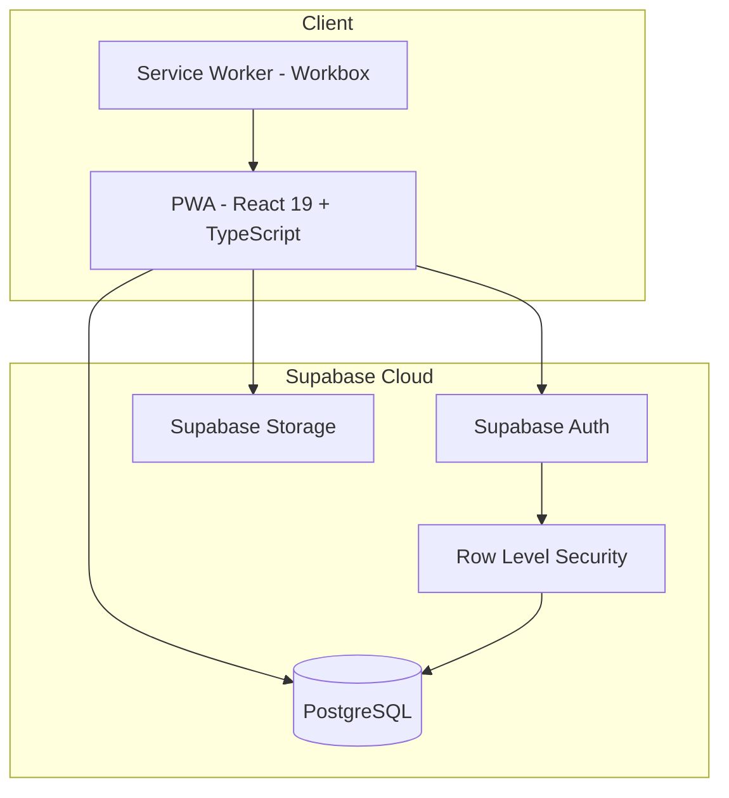

### Frontend Module Structure

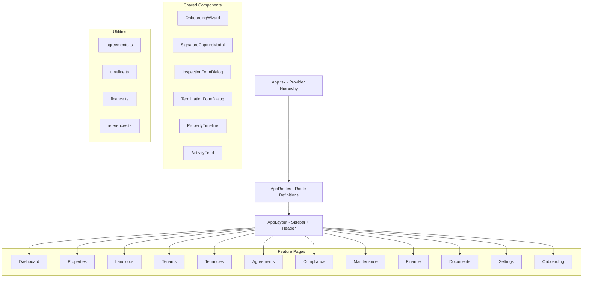

### Database Layer Architecture

```mermaid
graph TB
    subgraph Application Layer
        REACT[React Components]
        QUERY[TanStack Query]
        SUPA[@supabase/supabase-js]
    end

    subgraph Supabase Platform
        CLIENT[Supabase Client]
        AUTH_MW[Auth Middleware]
        RLS_POLICIES[RLS Policies]
    end

    subgraph PostgreSQL
        CORE[Core Tables - roles, users, company_settings]
        ENTITIES[Entity Tables - properties, landlords, tenants]
        TENANCY[Tenancy Tables - tenancies, renewals, terminations]
        FINANCE_T[Finance Tables - rent_transactions, expenses, statements]
        AGREEMENT[Agreement Tables - templates, generated, signatures]
        SYSTEM_T[System Tables - audit_log, notifications]
    end

    subgraph Storage
        BUCKETS[7 Storage Buckets]
    end

    REACT --> QUERY
    QUERY --> SUPA
    SUPA --> CLIENT
    CLIENT --> AUTH_MW
    AUTH_MW --> RLS_POLICIES
    RLS_POLICIES --> CORE
    RLS_POLICIES --> ENTITIES
    RLS_POLICIES --> TENANCY
    RLS_POLICIES --> FINANCE_T
    RLS_POLICIES --> AGREEMENT
    RLS_POLICIES --> SYSTEM_T
    SUPA --> BUCKETS
```

---

## 2. Key Workflows

### 2.1 Agency Onboarding

Two-phase wizard guiding new agencies through full setup.

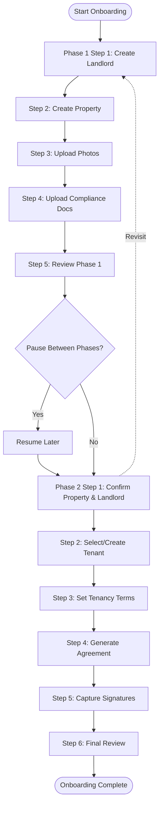

**State management:** Each phase tracks independent progress. Phase 2 can revisit Phase 1 at any time. State persisted in React component state (no backend persistence between steps).

**Key outputs:**
- Phase 1: `landlords`, `properties`, `property_photos`, `property_compliance`, `documents` records
- Phase 2: `tenancies`, `tenancy_tenants`, `generated_agreements`, `agreement_signatures` records

---

### 2.2 Tenancy Lifecycle

State machine governing tenancy from creation to termination.

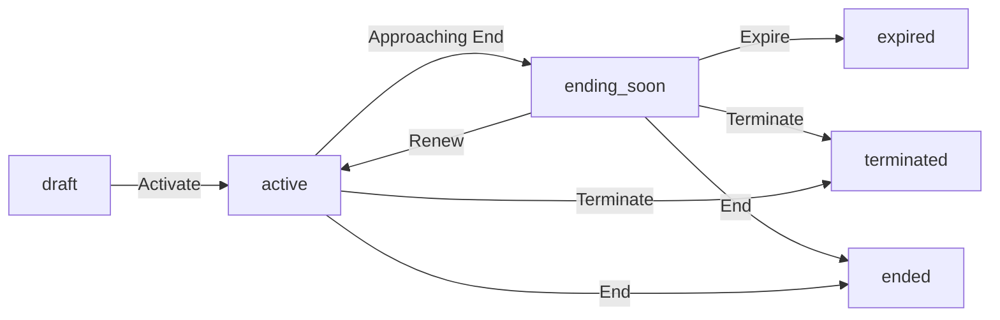

**Status transitions logged in `tenancy_status_log`** with from/to status, user, and reason.

#### Lifecycle Operations

| Operation | Trigger | Effect |
|-----------|---------|--------|
| **Renewal** | "Renew" button on TenancyDetailPage | Creates `tenancy_renewals` record, extends `end_date`, optionally updates rent |
| **Amendment** | Mid-tenancy change | Creates `tenancy_amendments` record (rent_change, tenant_add, tenant_remove, other) |
| **Termination** | "Terminate" button | Creates `tenancy_terminations` record with notice period, penalties, deposit deductions |
| **Inspection** | Scheduled or ad-hoc | Creates `tenancy_inspections` with rooms, items, photos |
| **Checklist** | Move-in/move-out | Creates `tenancy_checklists` with keys, meters, alarms |

---

### 2.3 Agreement Generation & Signing

End-to-end flow from tenancy to signed agreement.

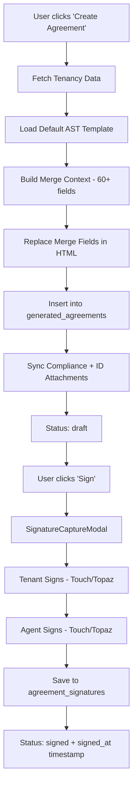

#### Merge Field Categories

| Category | Fields | Examples |
|----------|--------|---------|
| **Tenancy** | Dates, rent, deposit | `{{tenancy.start_date}}`, `{{tenancy.rent_amount}}` |
| **Property** | Address, type, rooms | `{{property.address}}`, `{{property.postcode}}` |
| **Landlord** | Name, address, contact | `{{landlord.full_name}}`, `{{landlord.email}}` |
| **Tenant(s)** | Name, NI number | `{{tenant.full_name}}`, `{{tenant.ni_number}}` |
| **Company** | Name, address, VAT | `{{company.company_name}}`, `{{company.vat_number}}` |

#### Signature Capture

- **Topaz signature pad:** Hardware device detected automatically; captures high-fidelity signatures
- **Touch/Mouse canvas:** Fallback using `signature_pad` library on HTML5 canvas
- **Multi-signatory:** Queue-based — all tenants sign first, then agent
- **Each signature stores:** base64 image, signatory type (tenant/agent), capture method, IP address, timestamp

---

### 2.4 Council Submission

Packaging signed agreement with compliance documents for city council.

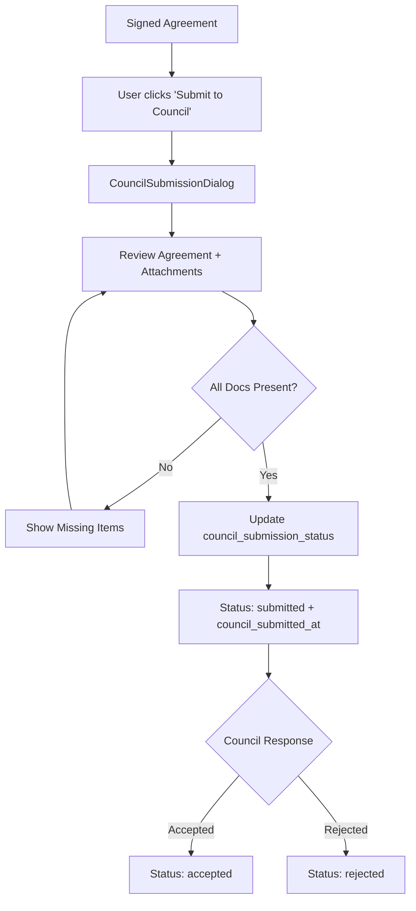

**Attachment types included in council pack:**
- Compliance certificates (Gas Safe, EICR, EPC) from `property_compliance`
- Tenant ID documents from `tenant_id_documents`
- Tenant references from `tenant_references`
- Filtered by `included_in_council_pack = TRUE`

---

### 2.5 Arrears Management

Workflow for managing tenants in rent arrears.

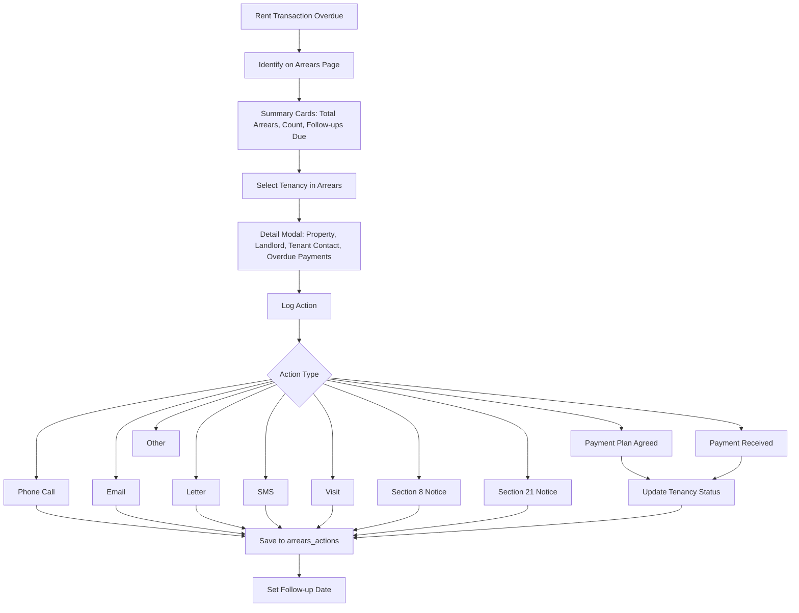

**Tenancy status progression in arrears:**
`active → arrears → payment_plan → legal_proceedings → terminated`

---

### 2.6 Inspection Workflow

Room-by-room property inspection with photo evidence.

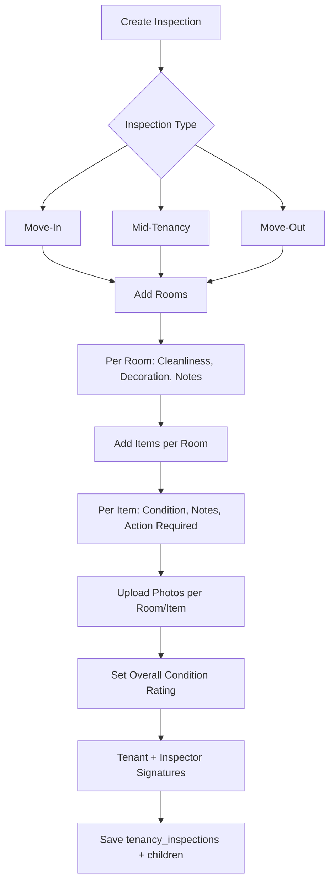

**Inspection hierarchy:**
```
tenancy_inspections
  ├── inspection_rooms (N)
  │   ├── inspection_room_items (N)
  │   │   └── inspection_photos (N)
  │   └── inspection_photos (N)
  └── inspection_photos (N, general)
```

---

### 2.7 Landlord Statement Generation

Monthly payout calculation and tracking.

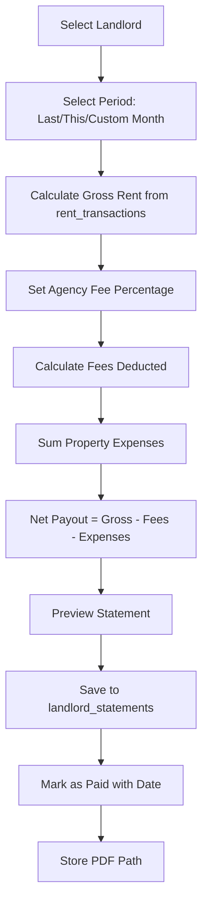

---

## 3. Data Flow Patterns

### Server State Management (TanStack Query)

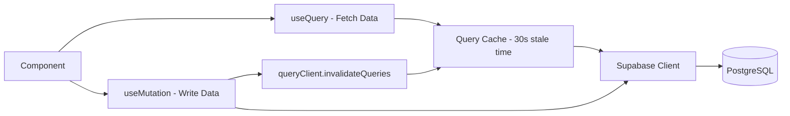

### Form Submission Pattern

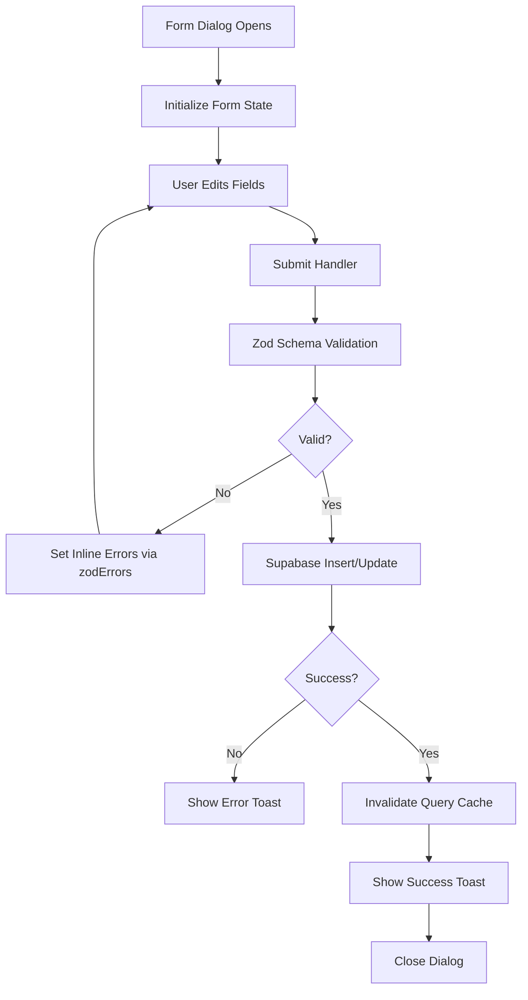

### Agreement Generation Data Flow

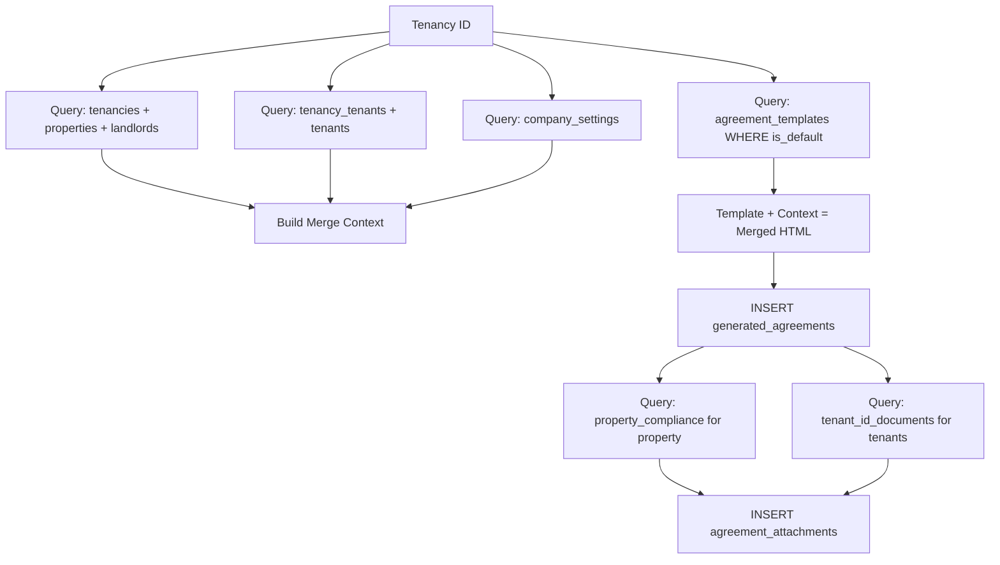

---

## 4. Frontend Architecture

### Component Composition Pattern

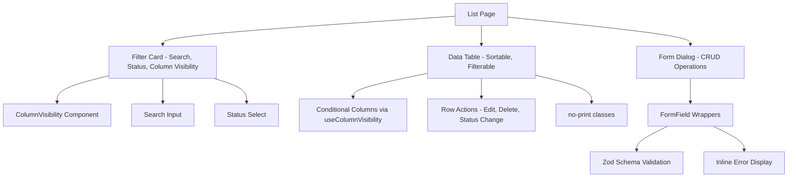

### Layout Structure

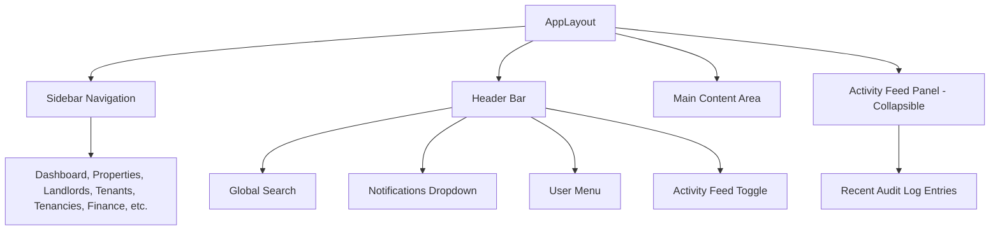

### Detail Page Tab Pattern

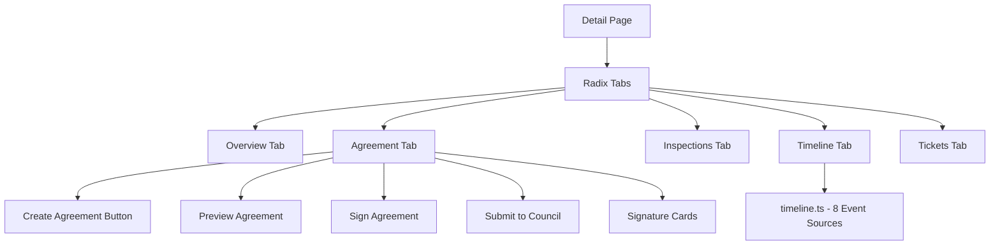

---

## 5. PWA Configuration

### Service Worker Strategy

| Resource Type | Strategy | Description |
|---------------|----------|-------------|
| **App shell** | Precache | HTML, JS, CSS cached during install |
| **API calls** | Network first | Always try network, fallback to cache |
| **Images** | Cache first | Cache on first load, serve from cache |
| **Fonts** | Cache first | Precached for offline support |

### Manifest

```json
{
  "name": "LettingsPro",
  "short_name": "LettingsPro",
  "start_url": "/",
  "display": "standalone",
  "background_color": "#ffffff",
  "theme_color": "#2563eb",
  "icons": [...]
}
```

### Build Configuration

- **Plugin:** `vite-plugin-pwa` with Workbox
- **Dev mode:** Service worker disabled (`devOptions: { enabled: false }`)
- **Production:** Full Workbox precaching + runtime caching strategies
- **Asset inlining limit:** 4096 bytes (assetsBase64)

---

## 6. Security Model

### Authentication Flow

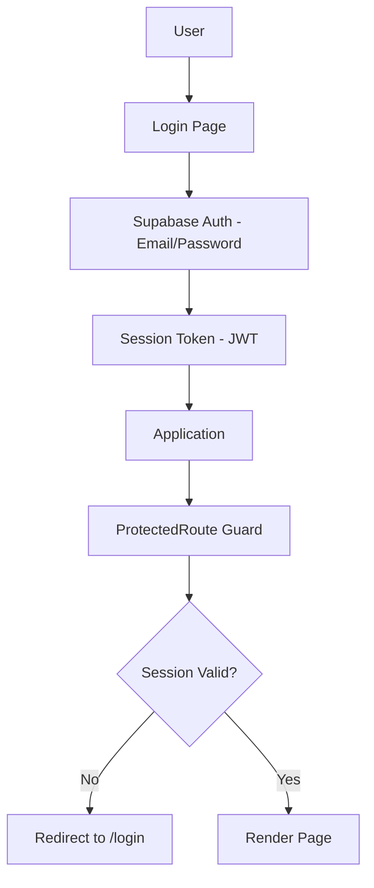

### Authorization Layers

| Layer | Mechanism | Scope |
|-------|-----------|-------|
| **Route protection** | `ProtectedRoute` component | All pages except `/login` |
| **Role-based access** | `users.role` + `permissions` table | Admin-only features (user mgmt, role editing) |
| **Row Level Security** | PostgreSQL RLS policies | All database tables |
| **Storage access** | Supabase Storage policies | All file uploads/downloads |

### RLS Policy Pattern

All tables use a blanket authenticated-user policy:

```sql
ALTER TABLE <table> ENABLE ROW LEVEL SECURITY;

CREATE POLICY "Authenticated access on <table>"
  ON <table> FOR ALL TO authenticated
  USING (true) WITH CHECK (true);
```

This means any authenticated Supabase user can access any table. Fine-grained access control is handled at the application layer via RBAC (role-based permissions checked in UI components).

### Admin-Only Enforcement

User and role management in Settings is restricted to admin users only:

```typescript
if (user.role !== 'admin') {
  // Hide user management UI
  // Disable role/permission editing
}
```

### Storage Bucket Policies

- **Private buckets** (property-photos, tenant-id-documents, landlord-id-documents, inspection-photos, documents, agreements): Authenticated users can read/write
- **Public bucket** (company-assets): Public read, authenticated write — used for company logo displayed on branded login page
